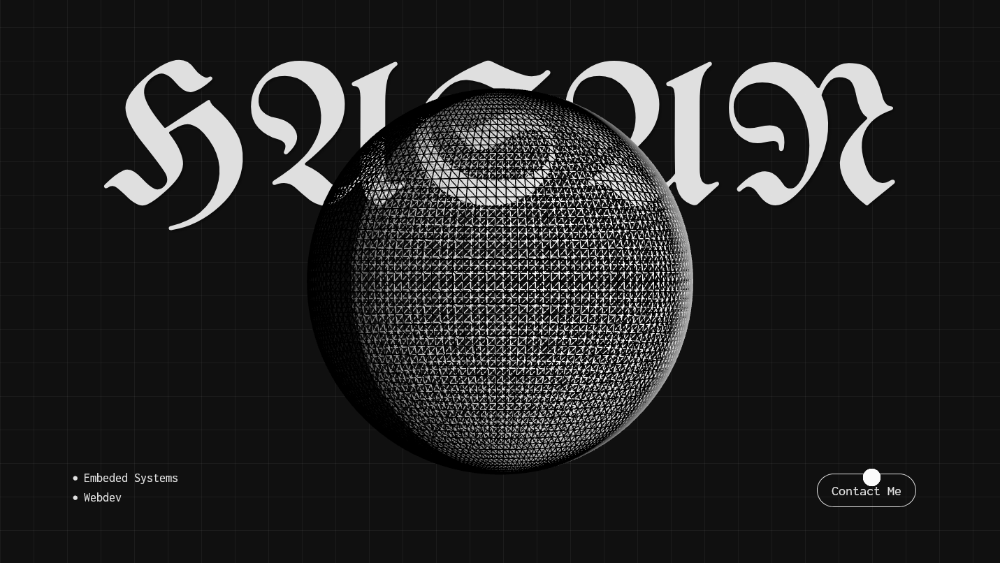

# mqverk – Portfolio

A minimal, animated personal portfolio site built with modern web tools.  
Highlights work across **FOSS**, **AOSP/Linux**, and **fullstack web**.

 <!-- optional: add a screenshot of your site -->

---

## About Me

- **Name:** Maverick (mqverk)
- **Age:** [redacted]
- **Location:** [redacted]
- **Focus:** FOSS, AOSP/Linux, Web
- **Passion:** Systems, embedded, and lean web builds
- **Status:** Available for work

### Connect

- [GitHub](https://github.com/mqverk)
- [LinkedIn](https://linkedin.com/in/mqverk)
- [Email](mailto:mqverk@proton.me)

---

## Tech Stack

- **Frontend:** HTML, CSS (Tailwind), JavaScript
- **Animation & Motion:** GSAP, Three.js, lenis, custom micro-interactions
- **Tooling/Deploy:** npm scripts, GitHub Pages

---

## Running Locally

```bash
# Clone the repository
git clone https://github.com/mqverk/web.git

npm install

npm run dev
```

⚠️ License: Educational use only.  
See [LICENSE](./LICENSE) for details.
